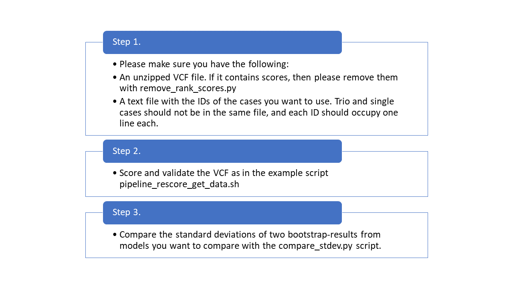

# Rank-Model-Validation-2023
This is a repository for the scripts used for my Master's thesis in 2023.

Note that many things in these scripts are hardcoded for the Scout database used in Lund and will have to be modified to fit your MongoDB database in order to gather information about known causative variants for example.

Here is a short summary on how the scripts should be run.

